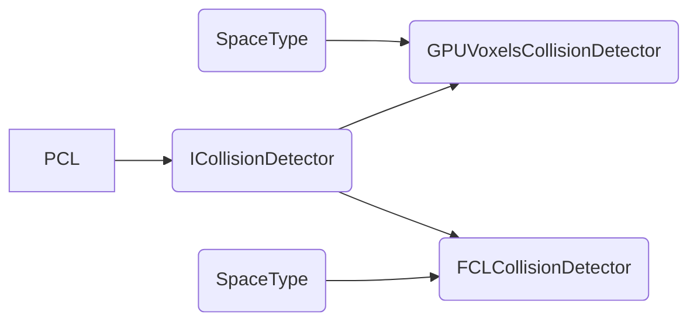
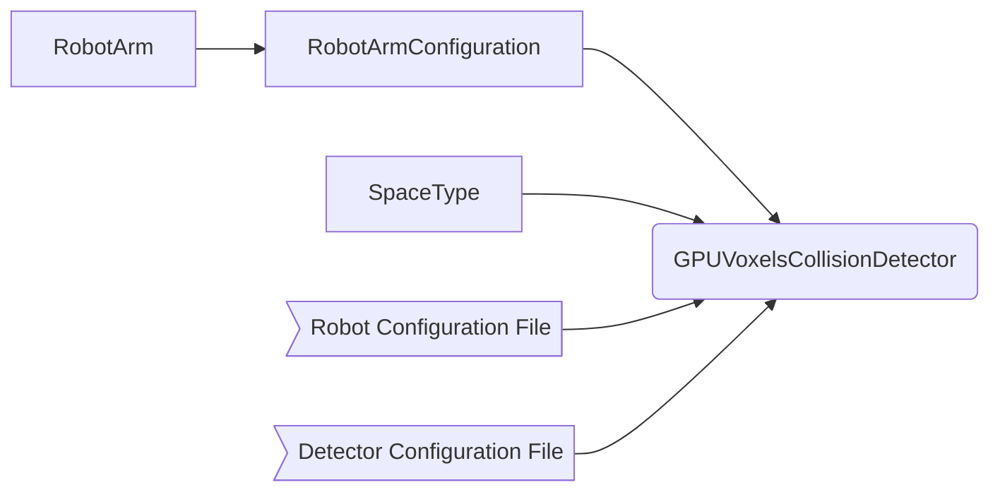
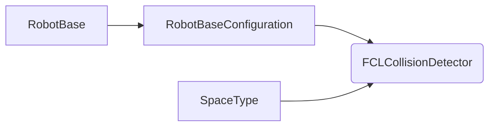

# Collision Detector {#collision_detector}

Collision detection is the task of checking if there is any kind of collision between two objects. In this case, we will have an environment and a robot, and we will be able to check either if a state or a motion is valid. 

## Implementations

Every implementation can work with different libraries. Currently, we have one implementation of the [GPU Voxels](https://www.gpu-voxels.org/) library and one of the [Flexible Collision Library](http://gamma.cs.unc.edu/FCL) working. The idea is that the first one is used in machines with CUDA and the latter in standard computers.



The space type defines if one of the dimensions is a real or a SO(2) space. This is relevant to check a motion because in the first case the distance function is the L2 norm, but in a SO(2) space the angle wrapping must be taken into account.  If you want to do a new implementation without any of these libraries, follow the Collision Detector interface.

### GPU Voxels

This is an implementation of the  [GPU Voxels](https://www.gpu-voxels.org/) library, based in [CUDA](https://developer.nvidia.com/cuda-zone). The class is designed to work with a robotic arm, passing its Denavit Hartenberg parameters and importing its models. If you want to use it for robot bases you can do it by defining it as a robot arm with the first two prismatic joints and one rotational joint, then by assigning a 3D model to only the last joint, it will work just like a base.



The *RobotArmConfiguration* object has the Denavit Hartenberg parameters and number of joints. The number of *SpaceTypes* must be the same as the number of joint and DH parameters. 

The *Robot Configuration File* gives extra information about the robot that the *RobotArmConfiguration* does not have. To import the 3D models of the robot you must define their directory and the name of each file. The *HomeState* is the position that each joint of the robot will have at the beginning. The *StateOffset* is adjustment value so that the position of each joint is the same in reality as in the simulation.

For the self-collision detection, the user must define between which links the algorithm must check the collision. Generally, contiguous links shouldn't be check for collision between them, because they might be always in collision in the joint. Furthermore, if the limits of each joint are correct two consecutive links can not collide between them, so it is just time-consuming to check it.

All this is done with the *Self-Collision Matrix* where rows and columns are defined by the number of the link. For example, if the first row of the matrix is *[0, 0, 1, 1, 1]*, it means that the collision between *Link1-Link1* and *Link1-Link2* won't be checked, but it will be checked for *Link1-Link3*, *Link1-Link4* and *Link1-Link5*. This means that the matrix must be symmetric and the diagonal equal to 0.

```ruby
{
    "LinksDirectory" : "CERNRoboticFramework/modules/Algorithms/CollisionDetector/models/ExampleRobot/",
    "LinkFileNames" :
    {
        "Link0" : "Link1.binvox",
        "Link1" : "Link2.binvox",
        "Link2" : "Link3.binvox",
        "Link3" : "Link3.binvox",
        "Link4" : "Link4.binvox"
    },
    "HomeState" :
    {
        "Joint1" : 0.0,
        "Joint2" : 0.0,
        "Joint3" : 0.0,
        "Joint4" : 0.0,
        "Joint5" : 0.0
    },
    "StateOffset" :
    {
        "Joint1" : 1.57,
        "Joint2" : 0.0,
        "Joint3" : 0.0,
        "Joint4" : 0.0,
        "Joint5" : 3.14
    },
    "SelfCollisionMatrix" :
    {
        "Link0" : [0, 0, 1, 1, 1],
        "Link1" : [0, 0, 0, 1, 1],
        "Link2" : [1, 0, 0, 0, 1],
        "Link3" : [1, 0, 0, 0, 0],
        "Link4" : [1, 1, 1, 0, 0]
    }
}
```

The *Detector Configuration File* defines the behavior of the algorithm. It is important to have in a real application the *VisualizeSolution* set to false, since it consumes a lot of resources. The size of the space is defined by the *Resolution* in meters and the *Volume* (X, Y, Z) in number of Voxels, this means that in the case shown below each voxels is 10 *mm* and the size of the map is 3.0x3.0x1.5 meters.

The *CenterPosition* is the position of the robot on the map. It is important to know that in this representation there are no negative numbers, so the robot must be placed far enough from the origin so that it can never reach a negative position on the map. The checkMotion method does a linear interpolation between the given states and represent them depending on the value of the *MotionResolution*

```ruby
{
    "VisualizeSolution" : true,
    "Space" :
    {
        "Volume" :
        {
            "X" : 300,
            "Y" : 300,
            "Z" : 150
        },
        "Resolution" : 0.01
    },
    "CenterPosition" :
    {
        "X" : 1.5,
        "Y" : 1.5,
        "Z" : 0.0
    },
    "Robot" :
    {
        "MotionResolution" : 0.1,
        "Representation" : "Probabilistic VoxelMap"
    },
    "Environment" :
    {
        "Type" : 1,
        "Scale" : 1.0,
        "Representation" : "Probabilistic VoxelMap"
    }
}
```
Until now only three types of representation are implemented, deterministic voxelmap, deterministic octree and probabilistic voxelmap. There are several options to set the environment of the robot. In the *Detector Configuration File* you can define the type and depending on it you can later use the *updateMap* method to change it during the execution of the program.

 * **Type 1**: The environment map will be empty but you must define a scale to adjust the map that comes through the *updateMap* method. The map must have the same origin as the robot.

```ruby
"Environment" :
{
    "Type" : 1,
    "Scale" : 1.0,
    "Representation" : "Probabilistic VoxelMap"
},
```
 
 * **Type 2**: Imports directly a *pcd* file adjusting it with a scale. Here you can also change the map with the *updateMap* method. The file must have the same origin as the robot.

```ruby
"Environment" :
{
    "Type" : 2,
    "File" : "CERNRoboticFramework/modules/Algorithms/CollisionDetector/models/LHCSection.pcd",
    "Scale" : 1.0,
    "Representation" : "Probabilistic VoxelMap"
},
```

 * **Type 3**: You can put different boxes by defining the position of the lowest and highest corner. Consider the origin of the robot as the origin of the environment. The *updateMap* method is not supported with this type.

```ruby
"Environment" :
{
    "Type" : 3,
    "CubesNumber" : 3,
    "Cube1" : 
    {
        "LowerCorner" : [-0.5, -0.5, 0.0],
        "HigherCorner" : [-0.3, -0.3, 1.2]
    },
    "Cube2" : 
    {
        "LowerCorner" : [0.3, 0.3, 0.0],
        "HigherCorner" : [0.5, 0.5, 1.2]
    },
    "Cube3" : 
    {
        "LowerCorner" : [-0.4, -0.4, 1.2],
        "HigherCorner" : [0.4, 0.4, 1.3]
    },
    "Representation" : "Probabilistic VoxelMap"
},
```

#### 3D Models
For the environment only *pcd* file can be directly loaded or inserting Point Clouds in this format `pcl::PointCloud<pcl::PointXYZ>::Ptr` from [PCL](https://github.com/PointCloudLibrary/pcl) using the *updateMap* method. The values must be in meters. You can find a point cloud of a section of the LHC in the CERNBox of the CERNRoboticFramework.

For the models of the robot links the accepted format are *pcd* *xyz* and [*binvox*](https://www.patrickmin.com/binvox/). In this case the units are *mm*. The recommended option is using *binvox*, since it is a great GPU-based rasterizer that scans mesh files and generates binary voxelmaps. By default the user defines the size of the desired voxelspace and the tool will scale the mesh to fit into the space. To keep the scale and the coordinate systems origin of the model, the user can also specify a bounding box.

Everything was tested with version 1.27 of the binvox program. It is recommendable to use the voxelize shell script that makes sure that the coordinates origin and orientation of the models don't change. Both the scrip and the binvox executable are in the folder *models/Converters/Binvox/*

So basicallly the steps to generate the models are:

 * Find the STL file of the link.
 * Adjust the coordinates system so that is the same that the one in the Denavit Hartenberg parameters. The recommended program for this task is [Autodesk 3ds Max](https://www.autodesk.com/products/3ds-max/overview), that it ca be found in the *Computer Management Framework* (CMF) in your CERN Windows machine.
 * Put the STL file in the same place as the voxelize shell script and the binvox executable, by putting a scale to ensure that the model is in *mm*. The command is `./voxelize.sh path_to_mesh_file scaling_factor`.

#### Result Analysis Tools

There are several built in tools to analyze the result of the collision detector. For the first two, the visualization must be enable inside the *Detector Configuration File*.

 * Inside the GPU Voxels repository (*gpu-voxels/build/bin*) a visualizer (*gpu_voxels_visualizer*) can be launched. You have to execute it after the GPUVoxelsCollisionDetector object is constructed.
 * The method *displayPath* displays the complete path in the visualizer displayPath
 * The method *displayPerformanceResults* show duration of the insertion of the robot states and motions in the map and how long it takes to calculate the number of collisions

#### Improvements

There are several things that can be improved in this code and new functionalities that could be done. Some of them are:

 * Define the map size depending on the workspace of the robot, and putting it in the center of the map. At least in the robot arm implementation.
 * Try to delete the dependency of the RobotArm module.
 * Make a proper implementation to support robot bases (for now simple approximation of the base shape).

#### Known Issues

There some known issue apart from the ones listed in the [GitHub repository](https://github.com/fzi-forschungszentrum-informatik/gpu-voxels#known-issues) of the GPU Voxels library. They are:

 * For the moment the library has some memory leaks. This was already [notified](https://github.com/fzi-forschungszentrum-informatik/gpu-voxels/issues/102) and they should solve the problem soon.
 * In the self-collision map, the base of the robot does not appear in the visualizer. In the rest of the map, it is ok.
 * In some CUDA capable devices the Octrees give problems, so the map representations based on them must be avoid until this is solve. This was already [notified](https://github.com/fzi-forschungszentrum-informatik/gpu-voxels/issues/105) and they should solve the problem soon.

### Flexible Collision Library

This implementation of collision detection uses the [FCL](http://gamma.cs.unc.edu/FCL/fcl_docs/webpage/generated/index.html) library. We represent the environment model in form of an OctoMap object. OctoMap is an efficient probabilistic 3D mapping framework based on Octrees. The incorporation within the collision detector is done using the *updateMap* method (for now not used in the interface ICollisionDetector due to [PCL](https://github.com/PointCloudLibrary/pcl) dependency. The map must have the same origin as the robot.



The *RobotBaseConfiguration* contains a rough description of the robot's geometry. It stores the position of the center of the wheels, therefore we add an additional offset which should cover all bounds of the robot in x,y dimension. Assuming an omnidirectional motion control, we can use a rectangular shape to approximate the robot base's geometry.


The resolution of the octree will influence the collision check computation times. We assume the octomap will be computed by a third-party (point cloud generator). For any custom modification, just create an own octomap with desired resolution, then use a negativ flag to mark nodes that are not occupied and a positive one for those who are.
```
octomap::OcTree tree(DEFAULT_MAP_RESOLUTION);
tree.updateNode(octomap::point3d(.0, .0, .0), false);
tree.updateNode(octomap::point3d(1.0, -1.0, 0.1), true);
```

#### Modeling

The primary way to construct geometric objects in space with fcl is the `CollisionObject`, which forms the backbone of all collision and distance computations. Such an object consists of two components, its geometry, defined by a `CollisionGeometry` object, and its pose, defined by a `Transform` object.

Therefore, we convert every new state into a rigid transformation (i.e. a rotation and a translation). The translation is always a 3-entry vector, while the rotation can be described by a 3x3 rotation matrix or a 4-entry quaternion. We except the rotation to be provided in SO2-state space form (describing the XYZ-euler angles with bounds of [-pi, pi]).

According to this we need to formulate requirements for the user of the FCL collision detector. We assume that given pose is provided according to the *task state type* e.g., TaskPose in X, Y, Z, Roll, Pitch, Yaw values). If one uses a path planning algorithm with the collision detector, make sure that these requirements are held.

The space type defines if one of the dimensions is a real or a SO(2) space. In this implementation we take the SE(2) space as the default constructed statespace which copes with the beforehand explained conventions. All state spaces that are declared SO(2) space take angle wrapping into account, therefore value limits for the state in this dimensions have to pass a validity check. Here follows an example state:
```
// Check the Collision Result for the Robot
// in the TaskPose (X, Y, Z, Roll, Pitch, Yaw)
std::vector<float> state = {2.0, 2.0, .0, .0, .0, M_PI/2};
```

#### FCL Commands

This implementation supports the following queries: 

 * Collision Detection -- After calling `collide()`, the return value contains the number of contacts generated between the two objects, and the collision result contains information about the collision and contacts
 * Distance Computation -- After calling `distance()`, the return value contains the minimum distance between the two objects and the collision result contains information about the closest points on the objects. If the return value is negative, the objects are in collision.
 * Continuous Collision Detection -- After calling `continuousCollide()`, the return value contains the time of contact in (0,1), or 1.0 if the objects did not collide during movement from their initial poses to their final poses. Additionally, the collision result contains information about the collision time and status. We assume static environment in this check, i.e. only consider the transformation of the robot.

Within this scope, we follow the One-to-many approach: Collision/distance checking between a stand-alone CollisionObject (in our case the approximation of the robotbase) and all environmental objects in the vicinity. Specifically, CollisionObject items from the environment are registered with a `DynamicAABBTreeCollisionManager` before collision or distance checking is performed.

#### Known Issues

 * FCL and octomap are currently only compatible with octomap version 1.8.1, known [issue](https://github.com/flexible-collision-library/fcl/issues/406). Therefore, compile fcl with FCL_WITH_OCTOMAP "OctoMap library support" ON (see installation of octomap, fcl, libccd in main readme).
 * FCLCollisionDetectorUtility is written in this way because the fcl::CollisionManager uses these typedefs for the callback functions(using the C-style function pointers in declerations), not nice, will be faced in [issue](https://github.com/flexible-collision-library/fcl/issues/379)
 * Currently, fcl uses Eigen 3.0.5. The upgrade to current Eigen version was mentioned in this [issue](https://github.com/flexible-collision-library/fcl/issues/285)

#### Improvements

New functionalities that will be targeted in the future:

 * Reduce computation time for octree's
 * More sophisticated implementation to support robot bases (for now simple approximation of the base shape).
 * Integration of a visualizer

## Known Issues

 * The PathPLanner module depends of this module, and if we add the PCL dependency it enters in conflict with OMPL in some computers (The server is one of them), and it's not passing the test. The temporal solution to allow the server to run the tests correctly is to comment the PCL dependency and deleting the updateMap method from the interface. This problem is already in an [issue](https://bitbucket.org/ompl/ompl/issues/480/segmentation-fault-problem-with-eigen) in the OMPL repository
