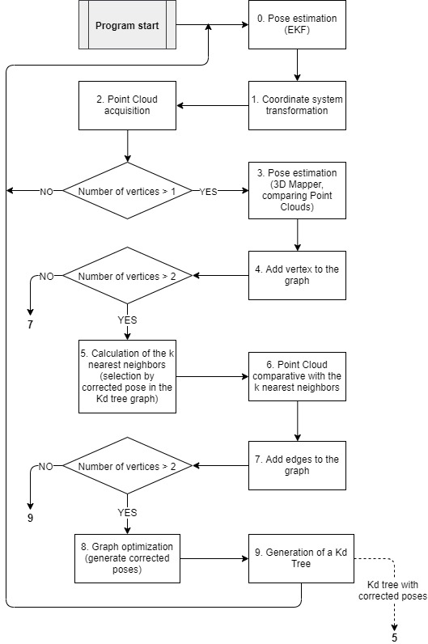

# Graph Optimization {#graph_optimization}

This package generates a multigraph and it optimizes it. The input of the graph is the supposed position of the robot (estimated by Kalman filter). The edges link each vertex with its previous one and with the K-1 closest. In each iteration, the graph is optimized in order to improve the accuracy of the position. 

## Install prerequisites

* Install graph generator library from source (version: commit fcba4ea on 23 Nov 2019): <https://github.com/RainerKuemmerle/g2o.git>. For more information: <https://openslam-org.github.io/g2o>

## Algorithm

## Samples

* kdtreeSample: Example of kd tree search
* MultiGraphOptimization: Using the RGBd camera. Each position may be specified (ground truth). Odometry is genered artifially with noise.
* MultiGraphOptimization: Using the Velodyne lidar. Each position may be specified  (ground truth). Odometry is genered artifially with noise.
* OfflineGraphOptimization: Take 'x' pictures in a row and the optimization is done offline.
* RobotPositionOptimizationComplet: Slam with RGBd camera.
* RobotPositionOptimizationSteps: Slam specifing each position as ground truth.
* RobotSimulation: The odometry is generated artifically, guessing a continous robot movement.
* SimpleGraphOptimization: Simplest graph optimization. Graph is not overconstraint (better use MultiGraphOptimization specifing only one neighbour).
* SlamWithVelodyne: Slam with Velodyne lidar.
