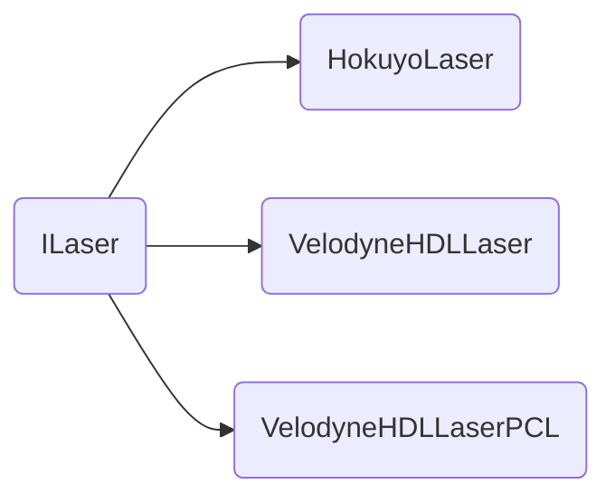
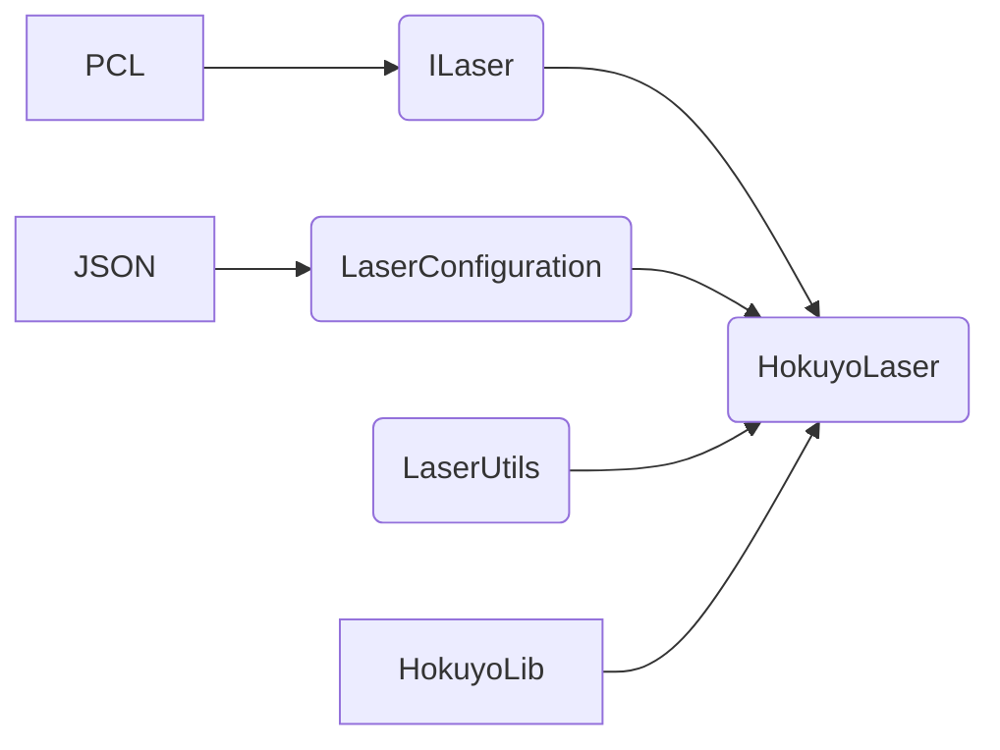
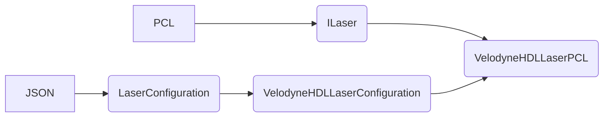
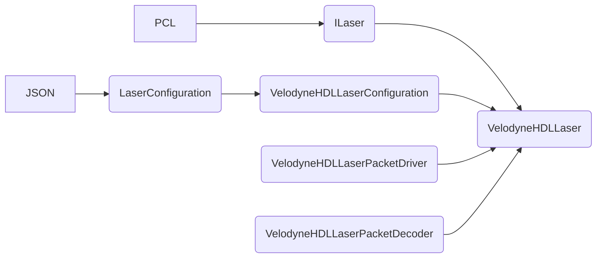

# Laser {#laser}
A 3D laser scanner can be based on many different technologies, each with its own limitations, advantages and costs. Many limitations in the kind of objects that can be digitized are still present. For example, optical technology may encounter many difficulties with shiny, reflective or transparent objects. This module allows you to communicate and extract information of these lasers.

## Implementations

Every laser and its implementation can work with different libraries. Currently, there are two lasers, the first one is the Hokuyo with one implementation. In the case of the Velodyne HDL there are two different implementations using different libraries.



If you want to do a new implementation without any of these libraries, follow the Laser interface. For each one a configuration file must be provided defining the following parameters.

```ruby
{
    "Model" : "URG04LXUG01",
    "ScanIntervalUs": 100000,
    "ScanSize": 726,
    "Range": {
        "Minimum": 0.020,
        "Maximum": 5.600
        },
    "AngularResolution": 0.352,
    "Angle": {
        "Minimum": -119.531250,
        "Maximum": 119.882812
    }
}
```

### Hokuyo

This is an implementation of the Hokuyo laser using its library. It has been tested on the UST20LX and URG04LXUG01.



### Velodyne HDL

The Velodyne HDL laser has been implemented in two different ways. For this laser more parameters are required in the configuration file, to be able to establish the communication.

```ruby
{
    "Model" : "HDL-32",
    "IPAddress" : "192.168.1.201",
    "UPDPort" : 2368,
    "CorrectionFile" : "cpproboticframework/modules/Sensors/Laser/config/32db.xml",
    "ScanIntervalUs": 100,
    "ScanSize": 0,
    "Range": {
        "Minimum": 1.0,
        "Maximum": 80.0
        },
    "AngularResolution": 0.4,
    "Angle": {
        "Minimum": -180.0,
        "Maximum": 180.0
    }
}
```

The first implementation is done using directly the [PCL Grabber](https://pcl-tutorials.readthedocs.io/en/latest/hdl_grabber.html?highlight=Velodyne). In this case the correction file (PCAP) contains the packet data of a network, using it to analyzed the network characteristics. The file of the Velodyne HDL 32 can be found in the CERNBox folder.



The second implementation was extracted from the [GitHub repository](https://github.com/nicrip/VelodyneHDL) and it doesn't depend directly on any library. The correction file is taken from the repository and it can be found in the configuration folder of this module.


#### Known Issues

There are some known issues:

 * The PCL Grabber implementation does not allow a safe way to exit the program. If the connection to the Velodyne is lost, like when the cable is disconnected. The HDLGrabber gets stuck if you try to deinitialize and destruct the object. This was already [notified](https://github.com/PointCloudLibrary/pcl/issues/4094) and they should solve the problem soon.
